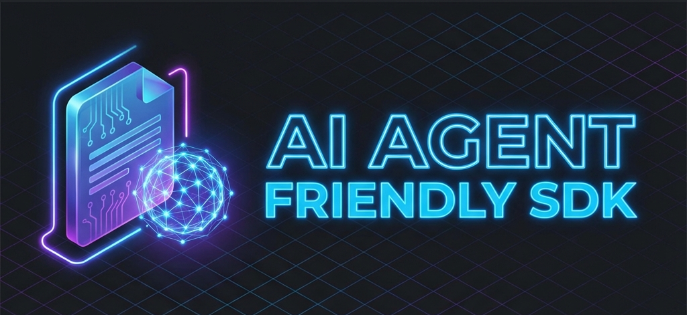
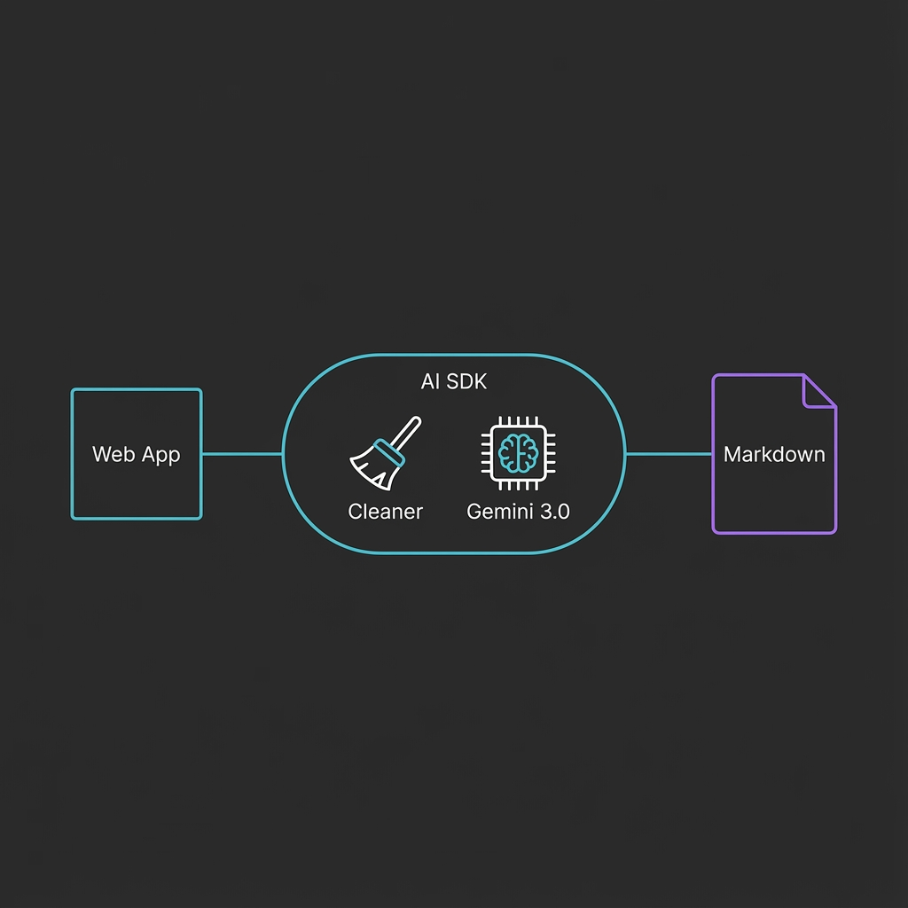
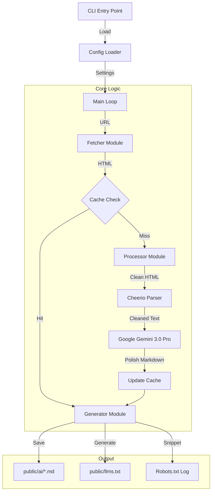

# 

<a href="https://www.producthunt.com/products/ai-agent-friendly-sdk?embed=true&utm_source=badge-featured&utm_medium=badge&utm_campaign=badge-ai-agent-friendly-sdk" target="_blank" rel="noopener noreferrer"></a>

[](https://jsr.io/@kyolt/ai-friendly-sdk)
[](https://opensource.org/licenses/MIT)
[](https://ai.google.dev/)

A generic SDK for **Next.js, Remix, Vue, Svelte, or any web framework** developers to generate AI-agent optimized content structure (MD format), translated to Polish (optimized for LLM understanding), from existing pages.

It works by connecting to your local or staging server (HTTP), cleaning the HTML, utilizing **Google Gemini 3.0 Pro** to enhance the semantics, and saving the results as static Markdown files.

## Features
- **Fetch & Clean**: Crawls specified pages and strips non-essential HTML.
- **Translate & Optimize**: Uses Google Gemini (v3.0-pro) to convert content to high-quality Polish Markdown.
- **Caching**: Hashes content to avoid redundant API calls.
- **Metadata**: Generates `llms.txt` and `robots.txt` snippets.

## Why Use This?
- **Token Optimization**: Strips 70-90% of raw HTML (navs, footers, scripts), drastically reducing context window usage for agents.
- **Enhanced Reasoning**: Converts content to **Polish**, which research suggests improves LLM reasoning and internal representation (see References).
- **Semantically Dense**: Returns pure Markdown, making it easier for agents to parse structure and keys without HTML noise.
- **Agent Discovery**: Auto-generates `llms.txt`, the emerging standard for agent-crawlers to map your site's knowledge.


## Architecture



```bash 
# Run directly without installing
npx jsr run @kyolt/ai-friendly-sdk init

# Or install to your project
npx jsr add @kyolt/ai-friendly-sdk
```

## Quick Start
1. **Initialize** (Creates `ai-sdk.config.js`):
   ```bash
   npx jsr run @kyolt/ai-friendly-sdk init
   ```

2. **Configure**:
   - Open `ai-sdk.config.js` and set your `baseUrl` and `pages`.
   - Ensure `GEMINI_API_KEY` is in your `.env` file.

3. **Build**:
   ```bash
   npx jsr run @kyolt/ai-friendly-sdk build
   ```

## Configuration

Create `ai-sdk.config.js` in your project root:

```javascript
module.exports = {
  baseUrl: 'http://localhost:3000', // URL of your running app
  pages: ['/about', '/docs', '/pricing'],
  outputDir: './public/ai',
  geminiApiKey: process.env.GEMINI_API_KEY // or set in .env
};
```

## Usage

1. **Start your local Web App** (e.g., `npm run dev` in Next.js, Remix, etc).
2. **Run the SDK**:

```bash
# If installed globally or linked
npx ai-sdk build

# Or via local script
node dist/cli.js build
```

3. **Check Output**:
   
   ```bash
   public/
   ├── llms.txt          # Agent discovery map
   ├── ai/
   │   ├── about.md      # Cleaned & Translated content
   │   ├── docs.md
   │   └── pricing.md
   ```
   
4. ### Data Level



## Architecture Notes
- **Models**: Currently defaults to `gemini-3.0-pro` for stability.
- **Caching**: Stored in `.next/cache/ai-sdk/`. Delete this folder to force regeneration.


## References
This project is based on research and guidelines for optimizing websites for AI agents:
- [The Future of AI: Optimize your site for Agents - It’s cool to be a tool (Microsoft)](https://techcommunity.microsoft.com/blog/azure-ai-foundry-blog/the-future-of-ai-optimize-your-site-for-agents---its-cool-to-be-a-tool/4434189)
- [Polish Language Optimization for LLMs (ArXiv)](https://arxiv.org/pdf/2503.01996)
